# GridShock Research Lab

[](https://github.com/SkinnyFatBoy05/gridshock-research-lab/actions/workflows/ci.yml)
[](https://www.python.org/)
[](LICENSE)

An auditable study of whether fixed-lag archived weather forecasts improve hourly
Germany/Luxembourg day-ahead electricity-price ranking. The repository ships with a real,
checksum-locked public-data fixture, chronological evaluation, a cost-aware research ledger, and
a self-contained HTML brief. The complete demo runs offline after installation.

> Historical research only. This project is not financial advice, an executable trading strategy,
> or a representation of market access, liquidity, collateral, imbalance settlement, or auction
> feasibility.

## Result at a glance

The strongest declared model, histogram gradient boosting, reduced final 45-day holdout MAE by
**51.6%** versus a 48-hour seasonal-naive comparator: **18.08 vs 37.36 EUR/MWh**. Its within-day
rank correlation was **0.897** across 1,080 unseen hourly observations.

| Final holdout model | MAE (EUR/MWh) | RMSE (EUR/MWh) | Daily rank correlation |
|---|---:|---:|---:|
| Histogram gradient boosting | **18.08** | **29.86** | **0.897** |
| Ridge | 21.79 | 33.64 | 0.863 |
| Seasonal naive | 37.36 | 54.81 | 0.805 |

The included long/short ledger is deliberately a **research proxy**: it chooses three predicted
high-price and three predicted low-price hours per complete delivery day, assigns one MWh per leg,
and applies EUR 0.50/MWh per-leg costs. Its unusually smooth historical result must not be read as
executable alpha. A within-day shuffled-prediction placebo produced **-EUR 67.60**, while the model
proxy produced **EUR 16,627.98**; this is a diagnostic of ranking information, not a P&L claim.

## Reproduce it offline

Install [uv](https://docs.astral.sh/uv/), clone the repository, then run:

```powershell
uv sync --frozen --extra dev
uv run gridshock demo
uv run gridshock train
uv run gridshock backtest
uv run gridshock report
uv run gridshock verify
```

`demo`, `train`, `backtest`, `report`, and `verify` use only the committed fixture. `fetch` is the
sole live-network command and intentionally accepts no more than 31 days per request.

The rendered brief is at [`reports/gridshock_research_brief.html`](reports/gridshock_research_brief.html).
Its inputs and chart outputs are bound by SHA-256 hashes in
[`reports/experiment_manifest.json`](reports/experiment_manifest.json).

## Research path

```mermaid
flowchart LR
    A[Official public APIs] --> B[Bounded source adapters]
    B --> C[Schema + unit contracts]
    C --> D[Availability-time checks]
    D --> E[Point-in-time feature matrix]
    E --> F[Rolling-origin validation]
    F --> G[Untouched 45-day holdout]
    G --> H[Cost-aware proxy + placebo]
    H --> I[HTML report + integrity manifest]
```



The declared decision cutoff is 12:00 `Europe/Berlin` on delivery day D-1. The central invariant is
`available_at_utc <= cutoff_utc` for every predictive feature. Prices, weather fields, units, source
payload hashes, request fingerprints, and retrieval timestamps are validated or recorded before
modelling. Local delivery-day logic uses `Europe/Berlin`; storage and joins use timezone-aware UTC,
including the 23-hour spring DST day.

## Data and scope

- **Target:** hourly DE-LU day-ahead price from the
  [Fraunhofer ISE Energy-Charts API](https://api.energy-charts.info/), attributed to SMARD under
  CC BY 4.0.
- **Weather predictors:** Open-Meteo
  [Previous Runs API](https://open-meteo.com/en/docs/previous-runs-api) `previous_day2` temperature,
  100 m wind speed, and shortwave radiation for Berlin, Hamburg, Frankfurt, and Munich; CC BY 4.0.
- **Common study window:** 2025-01-01 through 2025-09-30, 6,551 delivery intervals after the
  48-hour lag warm-up. This window avoids silently mixing hourly and quarter-hour products when
  the European day-ahead market moved to 15-minute intervals on **2025-10-01**.
- **Features:** 48-hour price lag, periodic calendar encodings, regional archived-weather means,
  simple heating/cooling and wind/solar proxies, and explicit missingness flags.
- **Evaluation:** three expanding rolling-origin validation folds followed by one untouched
  45-day chronological holdout. No random train/test split is used.

See [`docs/data-sources.md`](docs/data-sources.md),
[`docs/methodology-card.md`](docs/methodology-card.md), and
[`docs/architecture.md`](docs/architecture.md) for the detailed contracts and decision timeline.

## Verification

```powershell
uv run ruff format --check .
uv run ruff check .
uv run mypy src
uv run pytest -q
uv build
uv run gridshock verify
```

`gridshock verify` recalculates the committed dataset checksum, reruns the deterministic research
pipeline, compares the numerical summary with the experiment manifest, and verifies every report
figure hash. CI repeats these checks on Python 3.11 and 3.12.

## What this project demonstrates

- defensive ingestion of real third-party APIs with rate-limit handling and bounded retries;
- explicit data contracts, provenance, unit validation, and reproducible artifacts;
- leakage-resistant time-series evaluation with interpretable baselines;
- honest separation between forecast evidence and a stylised strategy abstraction;
- tested packaging, static typing, CI, and an answer-first research report.

Claim-to-artifact references and conservative résumé wording are recorded in
[`docs/claim-evidence.md`](docs/claim-evidence.md). Contributions are welcome through a focused
issue or pull request. Security reports should follow [`SECURITY.md`](SECURITY.md).

## License

Code is released under the [MIT License](LICENSE). The committed derived dataset retains the source
attributions and licences recorded in [`data/demo/manifest.json`](data/demo/manifest.json).
