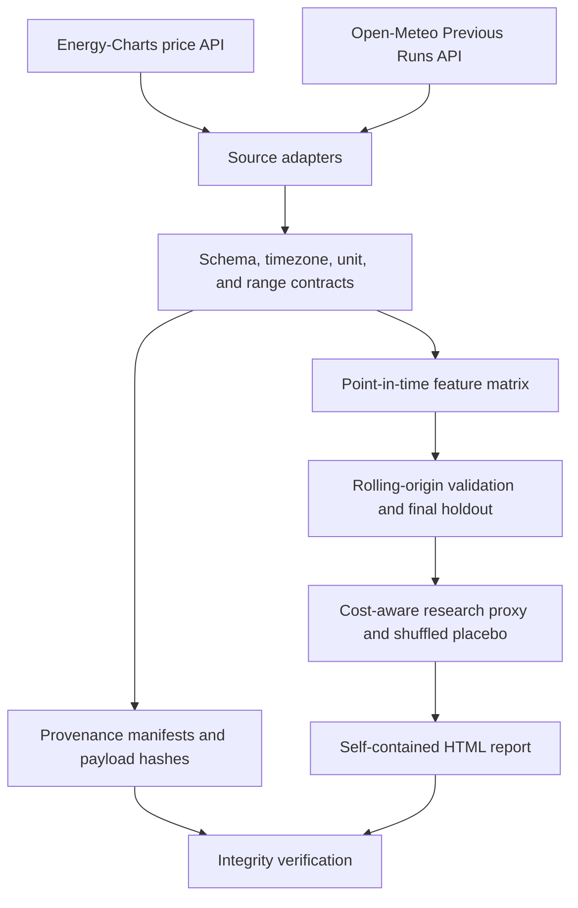

# Architecture

GridShock is a small, testable research system rather than a notebook-only result. Each layer has a
single responsibility and produces an artifact that the next layer can validate.



## Module map

| Module | Responsibility |
|---|---|
| `sources.py` | Bounded HTTP clients and defensive parsers for the two public APIs |
| `contracts.py` | Canonical schema, uniqueness, type, unit, and point-in-time assertions |
| `time.py` | UTC parsing, Europe/Berlin delivery days, DST, and auction cutoffs |
| `provenance.py` | Stable request fingerprints, payload hashes, and manifests |
| `dataset.py` | Availability-safe joins, lags, calendar features, and weather proxies |
| `validation.py` | Expanding rolling-origin folds plus an untouched chronological holdout |
| `models.py` | Seasonal-naive, ridge, and histogram-gradient-boosting comparators |
| `strategy.py` | Daily ranking positions, risk gates, cost ledger, and placebo |
| `reporting.py` | Deterministic figures, HTML brief, experiment manifest, and verification |
| `cli.py` | Offline demo/train/backtest/report/verify commands and bounded live fetch |

## Decision timeline

For each delivery day, the declared cutoff is 12:00 Europe/Berlin two calendar days before
delivery. Fixed-lag `previous_day2` weather fields are treated as available by that cutoff. The price
lag uses observations from 48 hours earlier and checks their own recorded availability. A feature
row is rejected if any predictive input became available after its cutoff.

```text
T-48h or earlier        declared decision cutoff             delivery interval
historical price  ---> all features known and checked ---> target price observed
archived forecast ---> available_at_utc <= cutoff_utc
```

All joins occur in timezone-aware UTC. Delivery-day grouping converts to `Europe/Berlin`, so the
spring transition is a valid 23-interval day instead of an automatically rejected missing hour.

## Reproducibility boundary

The committed fixture is the public review surface. `data/demo/manifest.json` records every source
request and payload digest; `reports/experiment_manifest.json` records the dataset digest,
evaluation results, chart map, and figure digests. `gridshock verify` recomputes the pipeline and
compares both layers. The live fetch command is intentionally separate because upstream APIs can
change or rate-limit independently of the reproducible demonstration.
